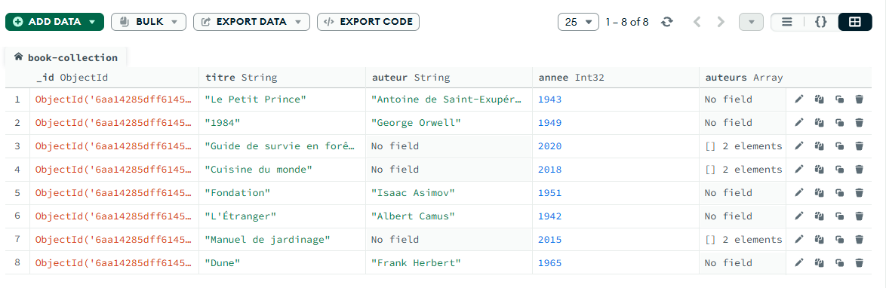
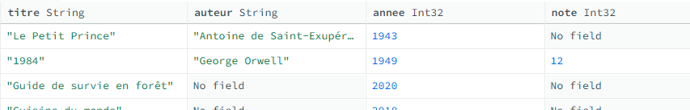

# Niveau 1 — IMITER — Prise en main de MongoDB

> Niveau d'apprentissage : **Imiter**
> Objectif : Découvrir MongoDB Compass et les opérations de base (observer, filtrer, modifier).



---

## 1.2 — Observer

### Q3 — Combien de documents ?

> *Combien de documents contient la collection ?*

La collection contient **8 documents**.

---

### Q4 — Le premier document

> *Affiche le tout premier document. Quel est son titre ?*

Le titre du premier document est : **« Le Petit Prince »**.

---

### Q5 — Le deuxième document

> *Affiche le deuxième document (pas le premier). Qui en est l'auteur ?*

L'auteur du second document est **George Orwell**.

---

### Q6 — Un document précis

> *Trouve le document dont le titre est celui de ton livre à auteurs multiples. A-t-il bien un champ `auteurs` au pluriel ?*

Le premier document avec plusieurs auteurs est **« Guide de survie en forêt »**. Il ne possède pas de champ `auteur` mais bien un champ `auteurs` (au pluriel) contenant deux éléments.

---

### Q7 — Chapitres

> *Ce même document a-t-il un champ `chapitres` ? Liste-les.*

Trois chapitres :

1. **Orientation**
2. **Feu**
3. **Abri**

---

### Q8 — Le plus ancien

> *Trouve le document le plus ancien de la collection.*

Le livre le plus ancien est **« L'Étranger »**, écrit par Albert Camus en **1942**.

---

### Q9 — Le plus récent

> *Trouve le document le plus récent.*

Le livre le plus récent est **« Guide de survie en forêt »**, écrit en **2020**.

---

### Q10 — Champ unique

> *Un seul document a un champ qui n'existe sur aucun autre. Lequel, et lequel est ce champ ?*

Un seul livre possède le champ `illustration` : **« Guide de survie en forêt »**.

---

## 1.3 — Filtrer (barre de filtre Compass)

Source : [MongoDB — Query Predicates (Comparison)](https://www.mongodb.com/docs/manual/reference/mql/query-predicates/comparison/)

### Q11 — Filtre sur une année précise

> *Trouve le livre publié une année précise de ton choix.*

```js
{ annee: 2018 }
// ou
{ annee: { $eq: 2018 } }
```

**Résultat :** « Cuisine du monde »

---

### Q12 — Filtre ">"

> *Combien de livres ont été publiés après 2000 ?*

```js
{ annee: { $gt: 2000 } }
```

**Résultat :** 3 livres

---

### Q13 — Filtre "<"

> *Combien de livres ont été publiés avant 1950 ?*

```js
{ annee: { $lt: 1950 } }
```

**Résultat :** 3 livres

---

### Q14 — Filtre sur un tableau

> *Trouve le livre qui contient un chapitre précis.*

```js
{ chapitres: "Feu" }
// ou
{ chapitres: { $eq: "Feu" } }
```

**Résultat :** « Guide de survie en forêt »

---

### Q15 — Filtre sur l'auteur

> *Trouve un livre à partir du nom exact de son auteur.*

```js
{ $or: [ { auteur: "S. Roux" }, { auteurs: "S. Roux" } ] }
```

> [!NOTE]
> Même si les champs `auteur` et `auteurs` semblent liés (singulier / pluriel), MongoDB les considère comme **deux champs distincts** et indépendants. Il faut donc chercher dans les deux.

**Résultat :** « Manuel de jardinage »

---

## 1.4 — Modifier (toujours en visuel)

### Q16 — Ajouter un champ

> *Ouvre un document et ajoute-lui un champ `note` avec une valeur de ton choix.*

Document modifié :

| Champ | Valeur |
|-------|--------|
| `_id` | `ObjectId('6aa14285dff614559c879285')` |
| `titre` | « 1984 » |
| `auteur` | « George Orwell » |
| `annee` | `1949` |
| `note` | `12` *(ajouté)* |

---

### Q17 — Vérifier l'ajout

> *Rouvre ce document pour confirmer que le champ est bien là.*



---

### Q18 — Ajouter un document

> *Insère un nouveau document avec un titre et une année de ton choix.*

Procédure dans Compass :

```
+ ADD DATA  →  Insert Document  →  respecter le format JSON  →  Insert
```

---

### Q19 — Vérifier le compteur

> *Le nombre total de documents a-t-il bien augmenté de 1 ?*

Oui, le compteur est passé à **9 documents**.

---

### Q20 — Supprimer

> *Supprime ce document ajouté. Le compteur est-il revenu à sa valeur initiale ?*

Procédure : sélectionner le document → cliquer sur l'icône **poubelle** → valider la suppression.

**Résultat :** retour à **8 documents**.
