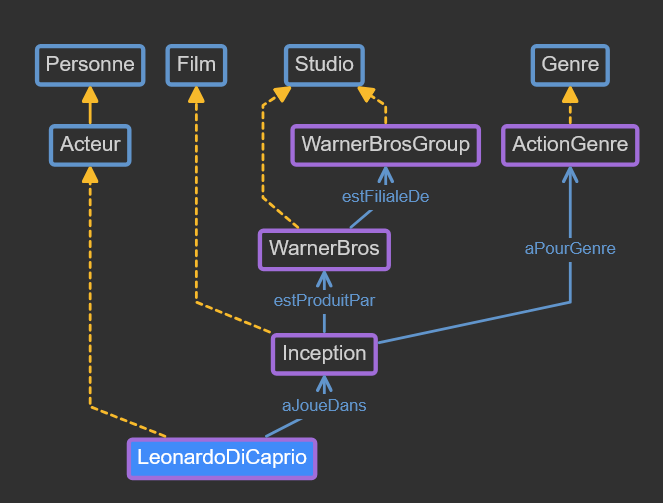
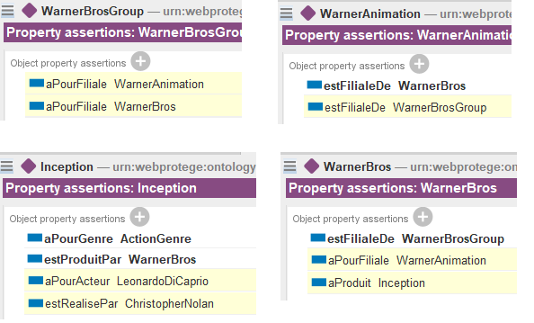
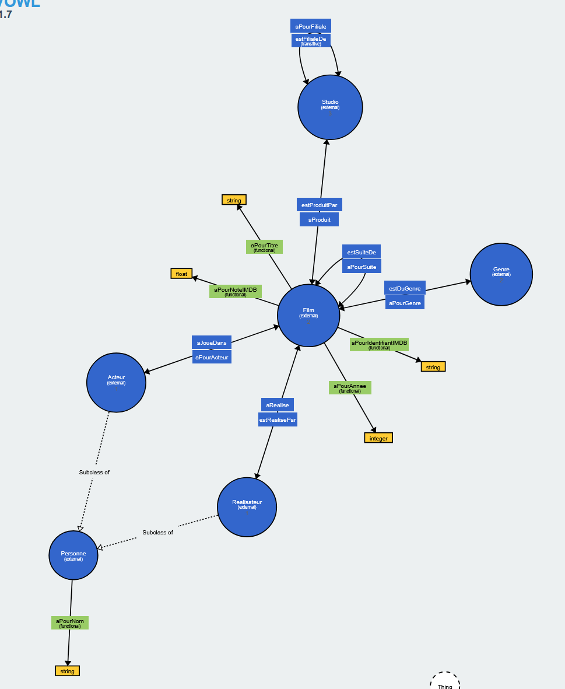

# Brief 1 - Partie 2 : Création d'une ontologie RDF/OWL
*Rendu : Ontologie "Cinéma Paradiso" avec Protégé Desktop*

---

## 1. Introduction
Ce brief vise à comprendre les concepts fondamentaux des ontologies en manipulant directement les éléments suivants :
- **Classes** et hiérarchies de sous-classes
- **Relations nommées** (Object Properties) entre les classes
- **Individus concrets** (instances)
- **Raisonneur** capable de déduire de nouveaux faits

Le domaine choisi est le **cinéma**, sans utilisation de base de données, de code, ou de MongoDB. L'objectif est de modéliser une ontologie complète en OWL/RDF.

---

## 2. Méthodologie
### Outils utilisés
- **Protégé Desktop 5.6.9** : [https://protege.stanford.edu/](https://protege.stanford.edu/) – Création et édition de l'ontologie
- **WebProtégé** : [https://webprotege.stanford.edu/](https://webprotege.stanford.edu/) – Visualisation du graphe des entités (EntityGraph)
- **WebVOWL** : [https://service.tib.eu/webvowl/](https://service.tib.eu/webvowl/) – Visualisation interactive du schéma OWL

### Étapes suivies
1. Analyse des exigences du brief (classes, propriétés, individus)
2. Création des classes et hiérarchies dans Protégé Desktop
3. Définition des **Object Properties** (relations entre classes) et **Data Properties** (attributs)
4. Ajout des individus et de leurs relations
5. Vérification des inférences via le raisonneur intégré
6. Export en RDF/OWL et visualisation avec WebVOWL

---

## 3. Implémentation technique

### Structure de l'ontologie

#### Classes et hiérarchies
| Classe | Sous-classe de | Description |
|--------|----------------|-------------|
| Personne | `owl:Thing` | Classe racine pour les personnes |
| Acteur | Personne | Représente un acteur |
| Réalisateur | Personne | Représente un réalisateur |
| Film | `owl:Thing` | Représente un film |
| Genre | `owl:Thing` | Représente un genre cinématographique |
| Studio | `owl:Thing` | Représente un studio de production |

#### Object Properties (relations entre classes)
| Propriété | Domain | Range | Inverse | Caractéristique |
|-----------|--------|-------|---------|-----------------|
| `aJoueDans` | Acteur | Film | `aPourActeur` | - |
| `aRealise` | Réalisateur | Film | `estRealisePar` | - |
| `aPourGenre` | Film | Genre | `estDuGenre` | - |
| `estProduitPar` | Film | Studio | `aProduit` | - |
| `estSuiteDe` | Film | Film | `aPourSuite` | **Non transitive** |
| `estFilialeDe` | Studio | Studio | `aPourFiliale` | **Transitive** |

> **Explication Domain/Range** :
> - **Domain** : Définit la classe de l'élément **source** de la relation (ex: `aJoueDans` a pour *Domain* `Acteur`, donc seul un `Acteur` peut être sujet de cette propriété).
> - **Range** : Définit la classe de l'élément **cible** de la relation (ex: `aJoueDans` a pour *Range* `Film`, donc la cible doit être un `Film`).
> - Ces contraintes garantissent la cohérence sémantique de l'ontologie.

#### Data Properties (attributs)
| Propriété | Domain | Type | Caractéristique |
|-----------|--------|------|-----------------|
| `aPourTitre` | Film | `string` | **Functional** |
| `aPourAnnee` | Film | `integer` | **Functional** |
| `aPourNoteIMDB` | Film | `float` | **Functional** |
| `aPourIdentifiantIMDB` | Film | `string` | **Functional** |
| `aPourNom` | Personne | `string` | **Functional** |

> **Functional** : Une propriété est *Functional* si un individu ne peut avoir qu'une seule valeur pour cette propriété (ex: un film a un seul titre).

#### Individus créés
| Individu | Classe | Data Properties | Object Properties |
|----------|--------|-----------------|-------------------|
| `ChristopherNolan` | Réalisateur | `aPourNom: "Christopher Nolan"` | `aRealise: Inception` |
| `LeonardoDiCaprio` | Acteur | `aPourNom: "Leonardo DiCaprio"` | `aJoueDans: Inception` |
| `Inception` | Film | `aPourTitre: "Inception"`, `aPourAnnee: 2010`, `aPourNoteIMDB: 8.8`, `aPourIdentifiantIMDB: "tt1375666"` | `aPourGenre: ActionGenre`, `estProduitPar: WarnerBros` |
| `Casablanca` | Film | `aPourTitre: "Casablanca"`, `aPourAnnee: 1942` | - |
| `ActionGenre` | Genre | - | - |
| `DrameGenre` | Genre | - | - |
| `WarnerBros` | Studio | - | `estFilialeDe: WarnerBrosGroup` |
| `WarnerAnimation` | Studio | - | `estFilialeDe: WarnerBros` |
| `WarnerBrosGroup` | Studio | - | - |

---

## 4. Visualisation et résultats

### Screenshots

#### 1. `J1P2_WebProtege_EntityGraph.png`

*Figure 1 : Graphique des entités et relations centrées sur l'individu **LeonardoDiCaprio** dans WebProtégé.*
- Montre les liens directs de l'acteur (ex: `aJoueDans: Inception`)
- Visualisation des propriétés et individus connectés

#### 2. `J1P2_Assertions-Automatiques.png`

*Figure 2 : Assertions automatiquement déduites par le **raisonneur** de Protégé.*
- Exemples d'inférences :
  - Si `Inception` `aPourActeur` `LeonardoDiCaprio`, alors `LeonardoDiCaprio` `aJoueDans` `Inception` (grâce aux propriétés inverses)
  - Hiérarchie transitive : `WarnerAnimation` `estFilialeDe` `WarnerBros` `estFilialeDe` `WarnerBrosGroup` → déduction automatique de la relation indirecte

#### 3. `J1P2-WebVOWL.png`

*Figure 3 : Graphe complet de l'ontologie dans **WebVOWL**.*
- Affiche toutes les **classes** (cercles), **propriétés** (flèches), et **individus** (nœuds colorés)
- Permet de naviguer dans la structure globale et de vérifier la cohérence du schéma OWL

---

## 5. Vérification et validation
- **Outils** : Raisonneur intégré de Protégé Desktop
- **Tests effectués** :
  - Vérification des **inférences** (propriétés inverses, transitivité)
  - Validation syntaxique du fichier RDF/OWL
  - Cohérence des *Domain/Range* pour toutes les propriétés

---

## 6. Conclusion
### Bilan
- Compréhension des concepts clés des ontologies : classes, propriétés, individus, raisonnement automatique
- Maîtrise de **Protégé Desktop** pour la modélisation OWL/RDF
- Utilisation des outils de visualisation (WebProtégé, WebVOWL) pour valider la structure

### Difficultés rencontrées
- Problème initial avec **WebProtégé** : impossibilité de créer les propriétés inverses, avec des erreurs de compilation sans explication claire
- **Solution** : Passage à **Protégé Desktop**, où la création des inverses et la gestion des propriétés a été fluide

### Améliorations possibles
- Ajouter des **contraintes supplémentaires** (ex: cardinalité min/max pour les propriétés)
- Étendre l'ontologie avec plus d'**individus** (ex: autres films, acteurs, studios)
- Tester d'autres **raisonneurs** (ex: HermiT, Pellet) pour comparer les inférences

---

## 7. Annexes
### Fichiers produits
- [Fichier RDF/OWL : `cinema_paradiso.rdf`](cinema_paradiso.rdf)
- Dossier des screenshots : [`screenshots/`](screenshots/)

### Ressources
- Brief : `brief1_partie2_ontologie_owl_rdf.pdf`
- Protégé Desktop : [https://protege.stanford.edu/](https://protege.stanford.edu/)
- WebVOWL : [https://service.tib.eu/webvowl/](https://service.tib.eu/webvowl/)
